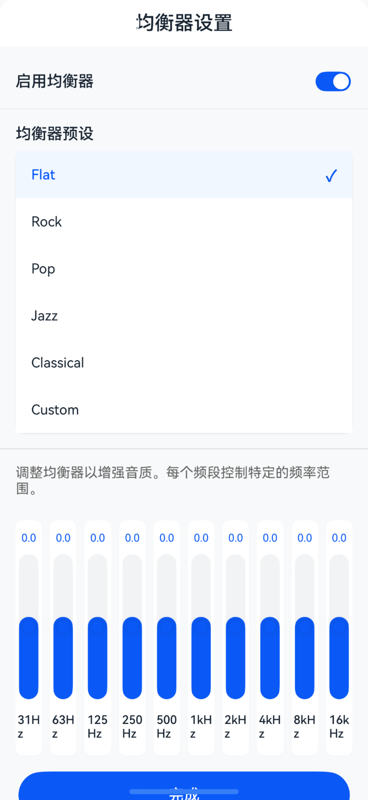
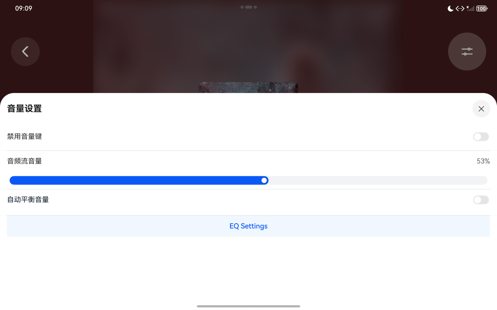

# Audio Stream Volume Management

## Project Introduction

This project is developed based on Huawei's official demo code for [audio-volume-management](https://gitcode.com/HarmonyOS_Samples/audio-volume-management).

This case demonstrates how to get volume, set volume, use gestures to adjust volume, customize volume panels, disable volume keys, implement automatic volume balancing, and 10-band equalizer (EQ) adjustment functionality, and it supports multi-platform deployment and cross-device flow.

## Main Features

- [x] System volume management
- [x] Audio stream volume control
- [x] Gesture volume adjustment
- [x] Custom volume panels
- [x] Volume key blocking
- [x] Automatic volume balancing
- [x] 10-band equalizer (EQ) adjustment
- [x] 5 preset EQ modes (Flat, Rock, Pop, Jazz, Classical)
- [x] Custom EQ band adjustment
- [x] Real-time audio effect application
- [x] Free flow (cross-device continuation)
- [x] Multi-device deployment (Phone, Tablet, Smart TV, Car Head Unit, Wearable)

## Preview

### Phone Interface


### Phone EQ Adjustment Interface


### Tablet Interface


## Usage Instructions

1. **Install Application**: Compile and install the application to HarmonyOS device using DevEco Studio.
2. **Enter Playback Page**: After launching the app, click the "Playback Page" button to enter the music playback interface.
3. **Play Music**: Click the play button to start playing music.
4. **Volume Settings**: Click the settings icon in the upper right corner to enter the volume settings panel:
   - **Disable Volume Keys**: Toggle the switch to disable/enable system volume keys
   - **Audio Stream Volume**: Slide the slider to adjust music playback volume
   - **Auto Balance Volume**: Enable to automatically smooth audio volume and avoid sudden changes
   - **Compression Strength**: Adjust the intensity of auto-balancing effect
   - **EQ Settings**: Click the "EQ Settings" button to enter the equalizer adjustment page
5. **EQ Adjustment**: In the EQ page you can:
   - Select from 5 preset EQ modes (Flat, Rock, Pop, Jazz, Classical)
   - Manually adjust 10-band equalizer settings
   - Enable/disable EQ effects
   - Preview audio effect changes in real-time
6. **Free Flow**: Seamlessly switch between different HarmonyOS devices while maintaining playback state and settings.

## Project Structure

```
├──entry/src/main/ets/
│  ├──common                           // Common modules
│  │  └──CommonConstants.ets           // Constants class
│  ├──components                       // Component modules
│  │  ├──AVVolumePanelView.ets         // System volume panel component
│  │  ├──ControlAreaComponent.ets      // Playback control area component
│  │  ├──SystemVolumePanelView.ets     // Custom system volume panel component
│  │  └──VolumePanelView.ets           // Custom volume panel component
│  ├──entryability
│  │  └──EntryAbility.ets              // Ability lifecycle callbacks
│  ├──entrybackupability
│  │  └──EntryBackupAbility.ets        // EntryBackupAbility lifecycle callbacks
│  ├──model                        
│  │  └──SongData.ets                  // Song entity
│  ├──pages
│  │  ├──Index.ets                     // Home page                             
│  │  ├──Player.ets                    // Playback page
│  │  └──EQPage.ets                    // EQ adjustment page
│  ├──player                             
│  │  ├──AudioRendererController.ets   // AudioRenderer playback control (includes EQ processing)
│  │  └──AudioVolumeController.ets     // AudioVolumeManager volume management
│  ├──utils
│  │  ├──ColorTools.ets                // Background color tools
│  │  ├──DeviceUtils.ets               // Device utilities (multi-device adaptation)
│  │  ├──Logger.ets                    // Logging tools
│  │  └──MediaTools.ets                // Media tools
│  └──viewModel
│     └──PlayerViewModel.ets           // Playback page data model
└──entry/src/main/resources            // Application static resources directory
```

## Implementation Details

### 1. System Volume Management
- Manage system volume through `audioVolumeManager`
- Adjust system volume size by sliding custom volume bars
- Monitor system volume changes and update UI in real-time

### 2. Audio Stream Volume Control
- Manage audio stream volume through `audioRenderer`
- Independent of system volume, can adjust application audio separately
- Supports gesture sliding adjustment

### 3. Volume Key Blocking
- Intercept volume keys by registering `inputConsumer.on('keyPressed')`
- Dynamically enable/disable system volume key functionality
- Prevent accidental operations from interfering with in-app volume adjustment

### 4. Automatic Volume Balancing
- Dynamically compress audio volume to avoid sudden changes
- Adjustable compression strength parameters
- Provides smoother listening experience

### 5. 10-Band Equalizer (EQ)
- Fine-tune 10 audio frequency bands (31Hz, 62Hz, 125Hz, 250Hz, 500Hz, 1kHz, 2kHz, 4kHz, 8kHz, 16kHz)
- 5 preset modes: Flat, Rock, Pop, Jazz, Classical
- Supports custom band adjustment
- Real-time audio effect application

### 6. Free Flow Support
- Supports HarmonyOS cross-device seamless continuation
- Automatically synchronizes playback state, volume settings, EQ settings
- Based on `continuable: true` configuration and `DISTRIBUTED_DATASYNC` permission

### 7. Multi-Device Deployment
- Supports Phone, Tablet, Smart TV, Car Head Unit, Wearable
- Uses `DeviceUtils` to implement responsive layout
- Adapts to different screen sizes and device types

## Related Permissions

- `ohos.permission.DISTRIBUTED_DATASYNC`: Used for free flow functionality, enabling cross-device data synchronization

## Dependencies

- HarmonyOS SDK 6.0.0 Release and above
- DevEco Studio 6.0.0 Release and above

## Recent Updates

### Added Automatic Volume Balancing Function
Added intelligent automatic volume balancing functionality with the following main features:

1. **Dynamic Volume Compression**:
   - Real-time monitoring of audio volume fluctuations with automatic gain adjustment
   - Smooth volume changes to avoid sudden volume jumps
   - Adjustable compression strength parameters (Low, Medium, High)

2. **Intelligent Algorithm**:
   - Based on RMS (Root Mean Square) calculation of audio signal strength
   - Uses dynamic range compression algorithm
   - Adaptive threshold adjustment, dynamically optimized based on audio content

3. **Real-time Processing**:
   - Applies volume balancing in real-time during audio playback
   - Low-latency processing without affecting audio quality
   - Supports continuous background operation

4. **User Control**:
   - Provides toggle control for enabling/disabling at any time
   - Compression strength slider adjustment
   - Real-time volume visualization display

### Added EQ Adjustment Function
Added comprehensive 10-band equalizer (EQ) adjustment functionality with the following main features:

1. **10-Band Equalizer Adjustment**:
   - Supports fine-tuning of 10 audio frequency bands (31Hz, 62Hz, 125Hz, 250Hz, 500Hz, 1kHz, 2kHz, 4kHz, 8kHz, 16kHz)
   - Each band supports gain adjustment from -12dB to +12dB
   - Real-time audio effect application with immediate feedback

2. **5 Preset EQ Modes**:
   - Flat: All frequency bands at 0 gain, maintaining original sound quality
   - Rock: Enhanced low and high frequencies for stronger rhythm
   - Pop: Enhanced mid frequencies and vocals, suitable for pop music
   - Jazz: Enhanced mid-high frequencies to highlight instrument details
   - Classical: Enhanced high frequencies for improved spatial sense and detail

3. **Intelligent EQ Algorithm**:
   - Weighted average algorithm calculates gain values for all frequency bands
   - Frequency weight optimization: low and high frequencies weight 1.2, mid frequencies weight 1.0
   - Volume limit protection: minimum volume 0.1, maximum volume 15 to prevent overload

4. **Real-time Monitoring and Synchronization**:
   - Added `@Watch` decorators in Player component to monitor EQ setting changes
   - Automatic synchronization of EQ state to audio renderer
   - Supports cross-device EQ setting synchronization (free flow functionality)

5. **User-Friendly Interface**:
   - Intuitive slider controls for each frequency band gain
   - One-click preset mode switching
   - Real-time audio effect preview
   - Supports custom EQ setting preservation

## Free Flow Support

This project supports HarmonyOS free flow capability, enabling seamless cross-device continuation experience.

### Features

1. **Application Continuation**: Supports seamless switching between different HarmonyOS devices while maintaining playback state
2. **State Synchronization**: Automatically synchronizes the following data:
   - Current playing song index
   - Playback state (playing/paused)
   - Volume settings
   - Auto balance volume settings
   - EQ equalizer settings
3. **Seamless Switching**: Application state automatically restores when users switch between devices

### Requirements

1. **Device Requirements**:
   - Both devices must be HarmonyOS 6.0.0 or above
   - Both devices must be logged into the same Huawei account
   - Both devices must have WLAN and Bluetooth enabled
   - Both devices must have continuation enabled in "Settings > Multi-device Collaboration > Continuation"

2. **How to Use**:
   - Open the app on the source device and start playback
   - Click the app icon in the Dock or task manager on the target device
   - The app automatically restores playback state on the target device

### Technical Implementation

1. **Configuration**:
   - Set `continuable: true` in `module.json5`
   - Request `ohos.permission.DISTRIBUTED_DATASYNC` permission

2. **Data Saving** (`onContinue` callback):
   ```typescript
   onContinue(wantParam: Record<string, Object>): AbilityConstant.OnContinueResult {
     // Save playback state, volume settings, EQ settings, etc.
     wantParam['currentSongIndex'] = currentSongIndex;
     wantParam['isPlaying'] = isPlaying;
     wantParam['currentVolume'] = currentVolume;
     // ... more data
     return AbilityConstant.OnContinueResult.AGREE;
   }
   ```

3. **Data Restoration** (`onCreate`/`onNewWant` callback):
   ```typescript
   if (launchParam.launchReason === AbilityConstant.LaunchReason.CONTINUATION) {
     // Restore data from want.parameters
     this.restoreContinueData(want);
   }
   ```

### Development Notes

- Data size limit: Data transmitted via wantParam must be under 100KB
- Lifecycle: `onCreate` for cold start, `onNewWant` for hot start
- State management: Use AppStorage for cross-component data synchronization
- Error handling: Return REJECT in onContinue to refuse migration

## Multi-Device Deployment Support

This project supports HarmonyOS multi-device deployment capabilities and can run on the following device types:

- **Phone** - Full feature support
- **Tablet** - Full feature support, adapted for large screen display
- **Smart TV** - Full feature support, adapted for TV interface
- **Car Head Unit** - Full feature support, adapted for in-car scenarios
- **Wearable** - Basic feature support, adapted for small screen display

### Adaptation Features

1. **Responsive Layout**: Uses the `DeviceUtils` utility class to implement adaptive layouts, automatically adjusting UI element sizes and spacing based on device screen dimensions
2. **Unified API Interface**: Uses HarmonyOS unified APIs to ensure functional consistency across different devices
3. **Device Capability Detection**: Automatically detects device audio capabilities and adapts to different device audio systems
4. **Touch Interaction Optimization**: Optimizes touch interaction experience for different device types

### Development Considerations

- Use `@Entry` and `@Component` decorators to ensure component compatibility across different devices
- Declare supported device types through the `deviceTypes` field in `module.json5`
- Utilize ArkUI adaptive layout capabilities to ensure good UI display across different screen sizes
- Test audio API compatibility for different device types

## Constraints and Limitations

1. This example supports running on the following HarmonyOS devices:
   - Phone
   - Tablet
   - Smart TV
   - Car Head Unit
   - Wearable

2. HarmonyOS system: HarmonyOS 6.0.0 Release and above.

3. DevEco Studio version: DevEco Studio 6.0.0 Release and above.

4. HarmonyOS SDK version: HarmonyOS 6.0.0 Release SDK and above.

5. Audio API support:
   - Audio capabilities may vary across different device types
   - Some advanced audio features may be limited on wearable devices
   - It is recommended to test audio playback and volume control functionality on actual devices

## Contributing

Issues and Pull Requests are welcome to improve this project.

## License

This project is open source under the Apache License 2.0.